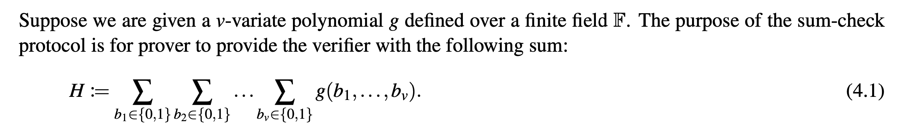
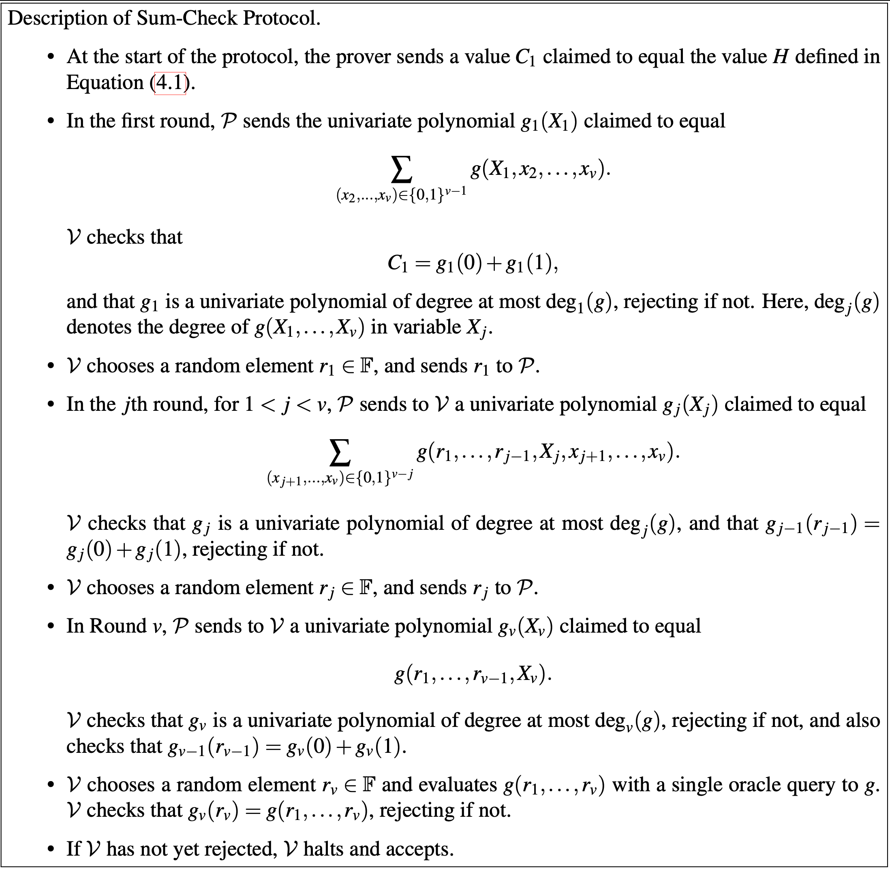

### Sumcheck protocol

this repo will contain sumcheck protocol using lambdaworks framework.

it will contain a prover, a verifier and test files.

a brief overview on sumcheck:

### Linear Time Sumcheck protocol on product of MLEs
this is an optimization on sumcheck protocol on product of MlEs based on this article https://eprint.iacr.org/2019/317.pdf#subsection.3.2.

recently live in branch feature-optimization, not completed yet. will be updated here.

